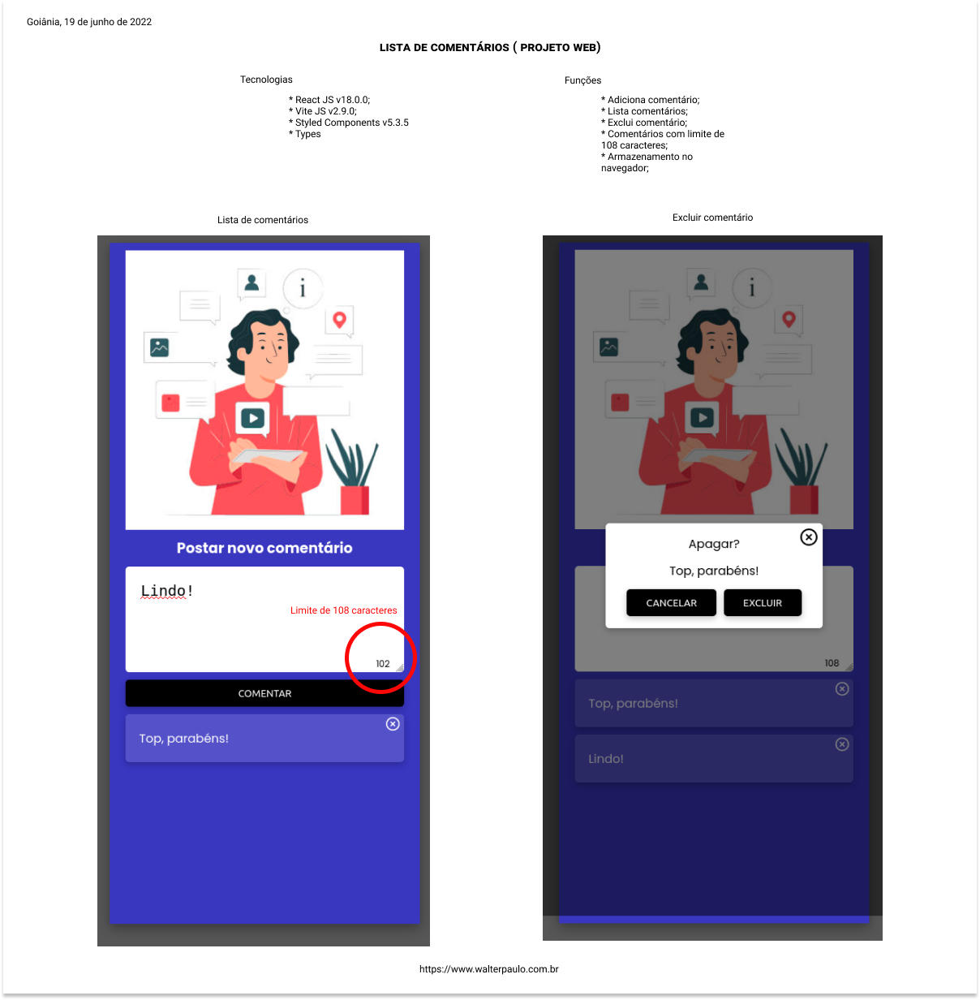

## Lista de Comentários

* Adiciona comentário;
* Lista comentários;
* Exclui comentário;
* Comentários com limite de 108 caracteres;
* Armazenamento no navegador;
* Projeto Web;

### Tecnologias

* React JS v18.0.0;
* Vite JS v2.9.0;
* Styled Components v5.3.5
* Types

### Resultado

Eu quero acessar o [vídeo](https://www.youtube.com/watch?v=z7SZD3p9BlE)

